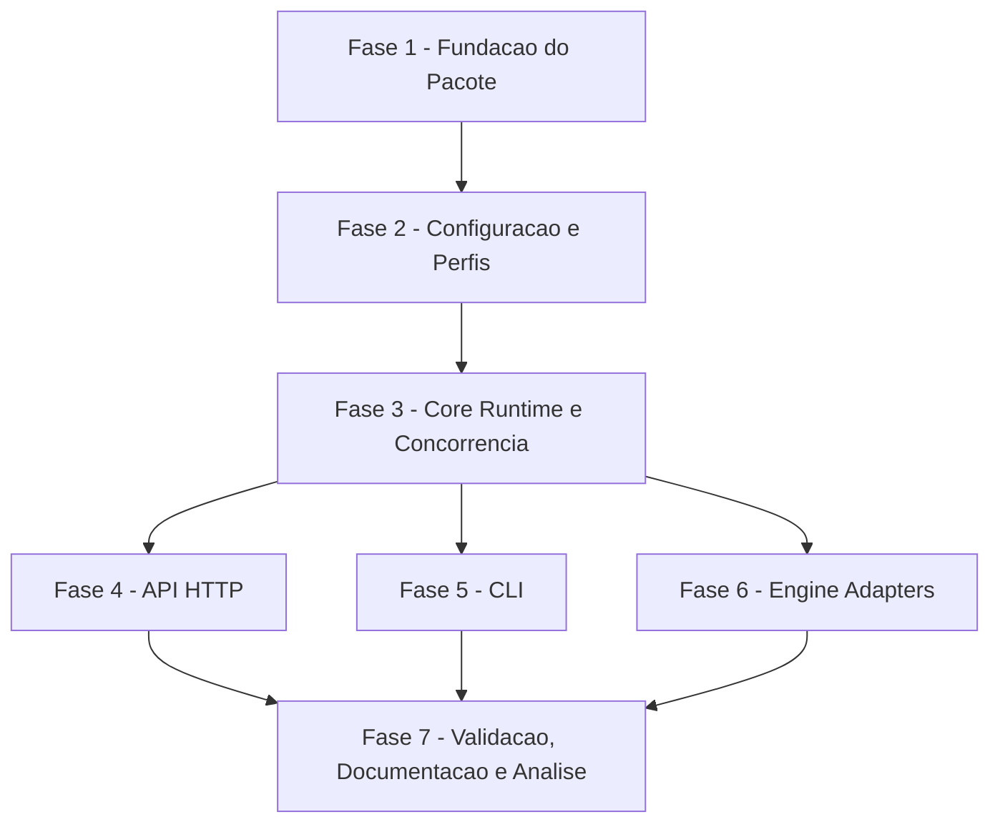

# Tarefas EccoVox - Speech Runtime

Escopo: implementar o runtime independente EccoVox com API HTTP, CLI, configuracao TOML, contratos STT/TTS, adapters `faster-whisper` e Kokoro, concorrencia conservadora, logs seguros e validacao por pytest.

**Legenda de status:**
- `[ ]` Pendente
- `[~]` Em andamento
- `[x]` Concluido
- `[!]` Bloqueado

**Legenda de criticidade:**
- `[C]` Critico - Impacto financeiro direto, regulatorio, seguranca, SLA ou operacao bloqueante
- `[A]` Alto - Funcionalidade essencial
- `[M]` Medio - Necessario, mas sem urgencia imediata

---

## FASE 1 - Fundacao do Pacote

### 1.1 Consolidar estrutura Python do projeto `[A]`

Ref: plan.md Project Structure; pyproject.toml

- [x] 1.1.1 Criar pacotes `api`, `core`, `engine` e `util` com `__init__.py`.
- [x] 1.1.2 Separar entrada CLI em modulo coeso sem regras de engine.
- [x] 1.1.3 Garantir que `pyproject.toml` declare CLI `eccovox` e extras `dev`, `stt`, `tts`, `voice`.
- [x] 1.1.4 Validar importacao do pacote e `python -m py_compile`.

### 1.2 Criar modelos internos de dominio `[A]`

Ref: data-model.md; spec.md Key Entities

- [x] 1.2.1 Definir modelos de health global, health por capacidade e status.
- [x] 1.2.2 Definir modelos de request/result STT e TTS internos em snake_case.
- [x] 1.2.3 Definir modelo de erro funcional com codigo, mensagem segura, retryable e details.
- [x] 1.2.4 Definir modelo de perfil/runtime com modo, engine, limites, formatos e budgets.
- [x] 1.2.5 Cobrir modelos com testes de criacao e validacao basica.

### 1.3 Implementar codigos de erro e excecoes funcionais `[A]`

Ref: contracts/eccovox-api.md Error Codes; spec.md FR-006, FR-025

- [x] 1.3.1 Criar codigos estaveis `invalid_audio`, `invalid_text`, `invalid_override`, `capability_disabled`, `capacity_exceeded`, `timeout`, `empty_transcription`, `runtime_unavailable` e `internal_error`.
- [x] 1.3.2 Criar excecoes funcionais internas sem mensagens sensiveis.
- [x] 1.3.3 Mapear excecoes para HTTP status e CLI exit code.
- [x] 1.3.4 Validar mapeamento com testes parametrizados.

---

## FASE 2 - Configuracao e Perfis

### 2.1 Implementar loader TOML com defaults `[A]`

Ref: spec.md FR-019, FR-026..FR-028; contracts/eccovox-api.md Configuration File

- [x] 2.1.1 Ler `eccovox.toml` com `tomllib` e defaults quando arquivo nao for informado.
- [x] 2.1.2 Suportar `server`, `runtime`, `stt`, `tts`, profiles, limits, budgets e temp dir.
- [x] 2.1.3 Validar tipos, valores obrigatorios e limites numericos.
- [x] 2.1.4 Garantir defaults `max_concurrent=1` e `queue_size=0`.
- [x] 2.1.5 Cobrir loader com testes para arquivo ausente, valido e invalido.

### 2.2 Centralizar perfis iniciais `[A]`

Ref: spec.md Clarifications; checklists/requirements.md CHK028

- [x] 2.2.1 Definir perfis `default`, `balanced`, `premium`, `diagnostic` e `process` como configuracao central.
- [x] 2.2.2 Fazer `default` apontar para perfil ativo configuravel.
- [x] 2.2.3 Permitir evolucao de nomes/perfis sem alterar contrato HTTP/CLI.
- [x] 2.2.4 Documentar que associacao perfil/modelo/voz por roles fica fora do MVP.
- [x] 2.2.5 Validar selecao de perfil e rejeicao de perfil inexistente.

### 2.3 Implementar overrides por chamada `[A]`

Ref: spec.md FR-020..FR-021; contracts/eccovox-api.md HTTP STT/TTS, CLI

- [x] 2.3.1 Normalizar overrides HTTP para modelos internos.
- [x] 2.3.2 Normalizar overrides CLI para modelos internos.
- [x] 2.3.3 Aplicar overrides apenas na operacao atual sem alterar defaults carregados.
- [x] 2.3.4 Rejeitar override invalido com `invalid_override` antes de chamar engine.
- [x] 2.3.5 Cobrir overrides validos e invalidos com testes.

---

## FASE 3 - Core Runtime e Concorrencia

### 3.1 Implementar interfaces de engine `[A]`

Ref: plan.md Implementation Approach 4; constitution.md Engine Replaceability

- [x] 3.1.1 Criar interface/base para adapter STT.
- [x] 3.1.2 Criar interface/base para adapter TTS.
- [x] 3.1.3 Criar engines fake para testes de contrato sem dependencias pesadas.
- [x] 3.1.4 Criar registry/factory de adapters por configuracao.
- [x] 3.1.5 Validar que API/CLI dependem apenas do core, nao de engines concretas.

### 3.2 Implementar runtime de health `[A]`

Ref: spec.md FR-001, FR-015..FR-018; contracts/eccovox-api.md HTTP Health

- [x] 3.2.1 Calcular status por capacidade considerando enabled, config, modelo e adapter.
- [x] 3.2.2 Calcular status global `ready`, `disabled`, `degraded` e `unavailable`.
- [x] 3.2.3 Retornar engine, model, device, formats e safeMessage quando aplicavel.
- [x] 3.2.4 Garantir health idempotente sem executar transcricao/sintese real.
- [x] 3.2.5 Cobrir combinacoes ready, disabled, degraded e unavailable com testes.

### 3.3 Implementar politica de concorrencia `[A]`

Ref: spec.md FR-024; contracts/eccovox-api.md Configuration File

- [x] 3.3.1 Criar controle por capacidade com `max_concurrent` e `queue_size`.
- [x] 3.3.2 Rejeitar excesso com `capacity_exceeded` quando fila for zero ou cheia.
- [x] 3.3.3 Garantir liberacao de semaforo em sucesso, erro e timeout.
- [x] 3.3.4 Separar limites de STT e TTS.
- [x] 3.3.5 Validar capacidade excedida com testes deterministas.

### 3.4 Implementar politica de temporarios e logs seguros `[C]`

Ref: spec.md FR-009..FR-010; constitution.md Privacy by Default

- [x] 3.4.1 Criar gerenciador de artefatos temporarios em `runtime.temp_dir`.
- [x] 3.4.2 Garantir limpeza em sucesso, erro e cancelamento controlado.
- [x] 3.4.3 Implementar logging sem audio bruto, audio gerado, texto sensivel integral ou segredos.
- [x] 3.4.4 Validar limpeza de temporarios com fixtures.
- [x] 3.4.5 Validar logs seguros nos cenarios de erro.

---

## FASE 4 - API HTTP

### 4.1 Implementar FastAPI app e health `[A]`

Ref: contracts/eccovox-api.md HTTP Health; plan.md Implementation Approach 7

- [x] 4.1.1 Criar app FastAPI com factory configuravel.
- [x] 4.1.2 Implementar `GET /v1/health`.
- [x] 4.1.3 Converter modelos internos para JSON camelCase do contrato.
- [x] 4.1.4 Mapear erros inesperados para resposta segura.
- [x] 4.1.5 Validar health com FastAPI/TestClient.

### 4.2 Implementar endpoint HTTP STT `[A]`

Ref: contracts/eccovox-api.md HTTP STT; spec.md FR-002

- [x] 4.2.1 Implementar `POST /v1/audio/transcriptions` com multipart.
- [x] 4.2.2 Validar arquivo ausente, vazio, tamanho maximo e overrides.
- [x] 4.2.3 Chamar runtime STT usando controle de concorrencia.
- [x] 4.2.4 Retornar texto, idioma, confidence/duration e metadata segura.
- [x] 4.2.5 Validar sucesso, invalid_audio, empty_transcription, timeout e unavailable.

### 4.3 Implementar endpoint HTTP TTS `[A]`

Ref: contracts/eccovox-api.md HTTP TTS; spec.md FR-003

- [x] 4.3.1 Implementar `POST /v1/audio/speech` com JSON.
- [x] 4.3.2 Validar input vazio, limite de caracteres, formato, voz e speed.
- [x] 4.3.3 Chamar runtime TTS usando controle de concorrencia.
- [x] 4.3.4 Retornar bytes com `Content-Type` efetivo.
- [x] 4.3.5 Validar sucesso, invalid_text, unsupported format, timeout e unavailable.

### 4.4 Implementar handler HTTP de erros `[A]`

Ref: contracts/eccovox-api.md Error Response

- [x] 4.4.1 Converter excecoes funcionais para schema de erro HTTP.
- [x] 4.4.2 Preencher `retryable` conforme tipo de erro.
- [x] 4.4.3 Limitar `details` a diagnostico seguro.
- [x] 4.4.4 Garantir que erros de engine nao vazem stack trace ao consumidor.
- [x] 4.4.5 Cobrir handlers com testes de contrato.

---

## FASE 5 - CLI

### 5.1 Implementar comando `serve` `[A]`

Ref: contracts/eccovox-api.md CLI Server Mode; plan.md Implementation Approach 8

- [x] 5.1.1 Criar comando Typer `eccovox serve`.
- [x] 5.1.2 Aceitar `--host`, `--port` e `--config` com precedencia documentada.
- [x] 5.1.3 Inicializar Uvicorn com app configurado.
- [x] 5.1.4 Retornar exit code estavel em falha de configuracao.
- [x] 5.1.5 Validar `serve --help` e erro de config com testes CLI.

### 5.2 Implementar comando `transcribe` `[A]`

Ref: contracts/eccovox-api.md CLI STT Mode; spec.md FR-004, FR-022

- [x] 5.2.1 Criar comando `eccovox transcribe` com `--file`, `--language`, `--profile`, `--model`, `--device`, `--compute-type` e `--format`.
- [x] 5.2.2 Escrever apenas resultado JSON em stdout no sucesso.
- [x] 5.2.3 Escrever apenas diagnostico seguro em stderr.
- [x] 5.2.4 Retornar exit codes conforme contrato.
- [x] 5.2.5 Validar sucesso e erros com runner CLI e engine fake.

### 5.3 Implementar comando `synthesize` `[A]`

Ref: contracts/eccovox-api.md CLI TTS Mode; spec.md FR-023

- [x] 5.3.1 Criar comando `eccovox synthesize` com `--text`, `--voice`, `--output`, `--format`, `--language`, `--profile` e `--speed`.
- [x] 5.3.2 Gravar audio em arquivo via `--output` no MVP.
- [x] 5.3.3 Manter stdout vazio no sucesso com `--output`.
- [x] 5.3.4 Escrever diagnostico seguro em stderr e exit codes estaveis.
- [x] 5.3.5 Validar arquivo gerado, stdout/stderr e erros com testes CLI.

---

## FASE 6 - Engine Adapters

### 6.1 Implementar adapter `faster-whisper` `[A]`

Ref: research.md; spec.md STT; plan.md Implementation Approach 9

- [x] 6.1.1 Carregar `faster-whisper` somente quando extra STT estiver instalado e capacidade habilitada.
- [x] 6.1.2 Aplicar modelo, device, compute type, idioma e prompt conforme configuracao/override.
- [x] 6.1.3 Converter segmentos/resultado para modelo interno normalizado.
- [x] 6.1.4 Adaptar erros de modelo ausente, audio invalido e engine failure para codigos funcionais.
- [x] 6.1.5 Criar teste operacional marcado/isolado para ambiente com extra STT disponivel.

### 6.2 Implementar adapter Kokoro `[A]`

Ref: research.md; spec.md TTS; plan.md Implementation Approach 9

- [x] 6.2.1 Carregar Kokoro somente quando extra TTS estiver instalado e capacidade habilitada.
- [x] 6.2.2 Aplicar voz, idioma, formato e speed conforme configuracao/override.
- [x] 6.2.3 Converter saida da engine para bytes e content type efetivo.
- [x] 6.2.4 Adaptar erros de voz/modelo indisponivel, texto invalido e engine failure.
- [x] 6.2.5 Criar teste operacional marcado/isolado para ambiente com extra TTS disponivel.

### 6.3 Documentar e validar licencas de runtime `[M]`

Ref: docs/licenses.md; constitution.md Governance

- [x] 6.3.1 Revisar licencas efetivas das dependencias travadas no ambiente de desenvolvimento.
- [x] 6.3.2 Registrar observacoes de modelos e voice assets usados nos perfis iniciais.
- [x] 6.3.3 Atualizar `docs/licenses.md` se alguma dependencia exigir aviso adicional.
- [x] 6.3.4 Garantir que README direcione usuarios/distribuidores para a revisao de licencas.

---

## FASE 7 - Validacao, Documentacao e Analise

### 7.1 Executar suite automatizada `[A]`

Ref: plan.md Validation Scenarios

- [x] 7.1.1 Rodar `python -m py_compile` para o pacote.
- [x] 7.1.2 Rodar `pytest` para core, API e CLI com engines fake.
- [x] 7.1.3 Rodar comandos `eccovox --help`, `serve --help`, `transcribe --help` e `synthesize --help`.
- [x] 7.1.4 Registrar evidencia dos comandos e corrigir falhas do escopo.

### 7.2 Executar validacao operacional com extras `[M]`

Ref: quickstart.md; plan.md Validation Scenarios

- [x] 7.2.1 Instalar extras `stt`, `tts` ou `voice` em ambiente local controlado. <!-- validado em Linux com .venv312 Python 3.12 e extras dev,voice -->
- [x] 7.2.2 Validar health com engines reais habilitadas, disabled e unavailable. <!-- health real ready validado; disabled/unavailable cobertos por testes/fakes -->
- [x] 7.2.3 Validar STT com audio curto e TTS com texto curto. <!-- validado com ECCOVOX_RUN_ENGINE_TESTS=1 e sample WAV gerado por Kokoro -->
- [x] 7.2.4 Validar logs seguros e limpeza de temporarios. <!-- execução operacional real não registrou áudio/transcrição integral; temporários cobertos por teste dedicado -->
- [x] 7.2.5 Registrar limitacoes de hardware/modelos observadas. <!-- CPU validada; GPU/device específico permanece dependente do host alvo -->

### 7.3 Atualizar documentacao final do EccoVox `[M]`

Ref: README.md; quickstart.md; contracts/eccovox-api.md

- [x] 7.3.1 Sincronizar README com comandos reais e extras de instalacao.
- [x] 7.3.2 Atualizar quickstart com server mode, CLI mode, health, STT e TTS.
- [x] 7.3.3 Atualizar contrato se payloads finais divergirem da especificacao.
- [x] 7.3.4 Documentar conteudo longo, budgets, timeouts e limites configuraveis.

### 7.4 Preparar item futuro de perfis por roles `[M]`

Ref: checklists/requirements.md CHK024; spec.md Clarifications

- [x] 7.4.1 Registrar que criterios objetivos de qualidade por idioma/perfil ficam fora do MVP.
- [x] 7.4.2 Manter perfis centralizados para permitir associacao futura por consumidor/role.
- [x] 7.4.3 Garantir que o contrato atual aceite `profile` sem conhecer roles.
- [x] 7.4.4 Sugerir spec futura para governanca de perfis, modelos, vozes e roles.

---

## Matriz de Dependencias

## Resumo Quantitativo

| Fase | Tarefas | Subtarefas | Criticidade |
|------|---------|------------|-------------|
| 1 - Fundacao do Pacote | 3 | 14 | A |
| 2 - Configuracao e Perfis | 3 | 15 | A |
| 3 - Core Runtime e Concorrencia | 4 | 20 | C/A |
| 4 - API HTTP | 4 | 20 | A |
| 5 - CLI | 3 | 15 | A |
| 6 - Engine Adapters | 3 | 14 | A/M |
| 7 - Validacao, Documentacao e Analise | 4 | 17 | A/M |
| **Total** | **24** | **114** | - |

## Escopo Coberto

| Item | Descricao | Fase |
|------|-----------|------|
| Python package | Estrutura independente com CLI e extras | 1 |
| Config TOML | Defaults, perfis, limits, budgets e overrides | 2 |
| Core runtime | Health, errors, concorrencia e temporarios | 3 |
| API HTTP | Health, STT, TTS e erros | 4 |
| CLI | `serve`, `transcribe`, `synthesize` | 5 |
| Engines | `faster-whisper` e Kokoro atras de adapters | 6 |
| Privacy | Logs seguros e limpeza de temporarios | 3, 7 |
| Licensing | Apache-2.0 no projeto e auditoria de dependencias | 6 |
| Deferred profiles | Preparacao para perfis por roles em fase futura | 7 |

## Escopo Excluido

| Item | Descricao | Motivo |
|------|-----------|--------|
| Integracao Jarvis | Binding Spring, UI e AIChat services | Pertence ao backlog Jarvis |
| Live conversation/streaming | Audio streaming e conversa em tempo real | Fora do MVP e contrato futuro separado |
| Banco de dados | Persistencia de historico, jobs ou metricas | MVP local/single-host sem banco |
| Autenticacao/autorizacao | AuthN/AuthZ de consumidores | Consumidor/deploy local e host externo governam acesso |
| Perfis por roles | Associar modelo/voz a roles de usuario | Decisao futura registrada em CHK024 |
| Redistribuicao empacotada | Instalador final ou imagem oficial | Futuro, depende de auditoria de licencas/modelos |
